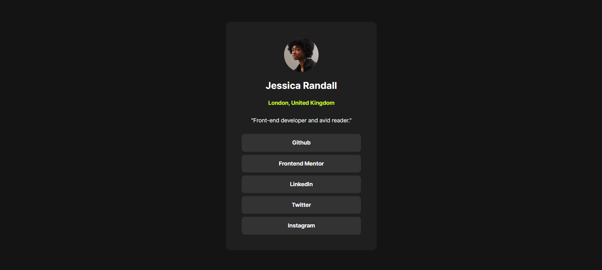

# Frontend Mentor - Social links profile solution

This is a solution to the [Social Links Profile card challenge on Frontend Mentor](https://www.frontendmentor.io/solutions/responsive-social-links-profile-card--QqDRa_2Fs). Frontend Mentor challenges help you improve your coding skills by building realistic projects.

## Table of contents

- [Overview](#overview)
  - [Screenshot](#screenshot)
  - [Links](#links)
- [My process](#my-process)
  - [Built with](#built-with)
  - [What I learned](#what-i-learned)
  - [Continued development](#continued-development)
  - [Useful resources](#useful-resources)
- [Author](#author)

## Overview

### Screenshot



### Links

- Live Site URL: [Live Preview](https://rishabhsikka3.github.io/social-links-profile/)
- Solution URL: [Frontend Mentor Solution](https://www.frontendmentor.io/solutions/responsive-social-links-profile-card--QqDRa_2Fs)

## My process

### Built with

- Semantic HTML5 markup
- CSS custom properties (variables)
- Flexbox
- Responsive design using `max-width` and padding
- Custom font embedding with `@font-face`
- Hover states for interactivity

### What I learned

This project helped me practice layout centering using Flexbox instead of absolute positioning. I also learned:

- How to load and apply custom fonts using local `.ttf` files
- How to use CSS transitions for subtle hover effects
- Importance of using `max-width` with `width: 100%` to maintain responsiveness
- How to style elements using semantic class naming and structure

```css
.container {
  height: 100vh;
  display: grid;
  padding: 2em;
}

.social-profile-card {
  max-width: 384px;
  padding: 40px;
  border-radius: 12px;
  background-color: var(--grey-800);
  margin: auto;
  text-align: center;
}
```

### Continued development

In future projects, I want to:

- Explore using CSS `clamp()` for more fluid typography.
- Explore container queries for layout control.
- Improve accessibility by ensuring keyboard navigation and screen reader compatibility.

### Useful resources

- [MDN Web Docs - @font-face](https://developer.mozilla.org/en-US/docs/Web/CSS/@font-face)
- [MDN Web Docs - Flexbox](https://developer.mozilla.org/en-US/docs/Web/CSS/CSS_flexible_box_layout/Basic_Concepts_of_Flexbox)
- [Frontend Mentor - Community Solutions](https://www.frontendmentor.io/solutions)

## Author

- Name – Rishabh Sikka
- Frontend Mentor – [@RishabhSikka3](https://www.frontendmentor.io/profile/RishabhSikka3)
